<h1 align="center">👋 Hi, I'm Eljo Hoxha</h1>

<h3 align="center"><samp>Senior Frontend &amp; Mobile Engineer</samp></h3>

  <kbd>React</kbd>&nbsp;
  <kbd>React Native</kbd>&nbsp;
  <kbd>TypeScript</kbd>&nbsp;
  <kbd>AI</kbd>

<em>I build products, not just interfaces.</em>

  Turning complex product ideas into scalable, production-ready web &amp; mobile applications.

  <b>5+ years</b> shipping production software &nbsp;·&nbsp; since <b>2021</b>

  

  
  
  

  
  

---

## 🚀 What I Do

- 🧩 **Build production-ready** web & mobile applications
- 🏗️ **Design scalable** frontend architectures
- 📱 **Develop cross-platform** apps with React Native & Expo
- 🔌 **Integrate REST & GraphQL** APIs
- 🔐 **Build authentication**, payments & real-time features
- ♻️ **Modernize & migrate** legacy applications
- ⚡ **Optimize** frontend and mobile performance
- 🚀 **Ship to production** — App Store & Google Play releases
- 🤖 **Use AI tools** to accelerate development and problem solving

---

## 🧠 Tech Stack

**Frontend**

**Mobile**

**State & Data**

**Backend & Infra**

**Auth, Payments & AI**

**Testing**

---

## 🧪 Testing Approach

| Layer                 | React / Web                    | React Native                    |
| --------------------- | ------------------------------ | ------------------------------- |
| **Unit**              | Jest · Vitest                  | Jest                            |
| **Component**         | React Testing Library          | React Native Testing Library    |
| **Hooks**             | `@testing-library/react-hooks` | `@testing-library/react-native` |
| **E2E / Integration** | Playwright · Cypress           | Detox · Maestro                 |
| **API Mocking**       | MSW                            | MSW                             |
| **Coverage**          | Istanbul / c8                  | Istanbul / c8                   |

---

## 🎓 Education

<table>
<tr>
<td width="60">🎓</td>
<td>

**Bachelor of Software Engineering** — _Class of 2026_
 
Mediterranean University of Albania

</td>
</tr>
</table>

---

## 📊 GitHub Stats

  
  

  

  

---

## 🔒 A Note On My Repositories

Most of my work lives in **private organization repositories** — client products,
internal platforms and production apps — so it isn't publicly visible here.

**What I've shipped across those codebases:**

- 📱 Cross-platform mobile apps released to the App Store & Google Play
- 🖥️ Large-scale React / Next.js web platforms serving real users
- 🏗️ Frontend architectures, design systems & shared component libraries
- 🔐 Auth, payments, real-time sync and offline-first data layers
- 🧪 Test suites with Jest, Testing Library, Detox & Playwright
- ⚙️ CI/CD pipelines and EAS build/release workflows

> Want to see code or a walkthrough? Reach out — I'm happy to share
> details about my contributions under NDA or in a call.

---

## 🤝 Let's Connect

  I'm open to <strong>senior frontend / mobile roles</strong>, <strong>freelance projects</strong>, 
  and <strong>product collaborations</strong>.

  
  

